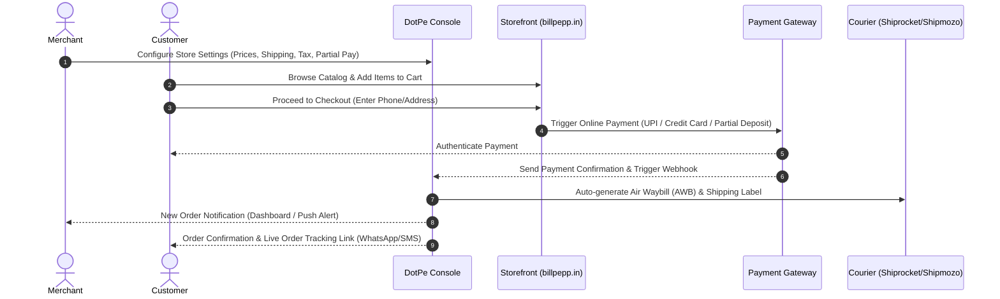
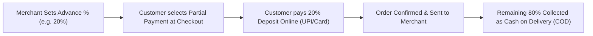
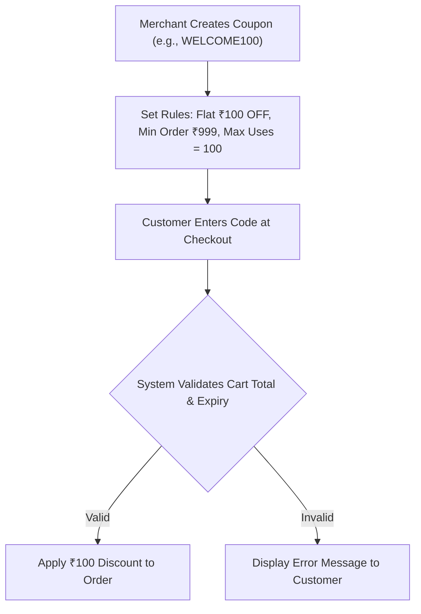

# Digital Showroom (DotPe) Web Console — Feature Operational Mechanism & System Documentation

**Store Name:** Bill Pepp  
**Active Domain:** [billpepp.in](https://www.billpepp.in)  
**Platform URL:** [web.dotpe.in](https://web.dotpe.in)  
**Access Role:** Owner Access  

---

## 1. System Operational Architecture

The **Digital Showroom (DotPe) Web Console** bridges merchant back-office administration with customer-facing e-commerce storefronts, payment networks, logistics providers, and POS billing.

---

## 2. Comprehensive Feature Breakdown — How Each Feature Works

---

### 2.1 Partial Payment
**Category:** Payments & Risk Mitigation  
**Console Location:** `eCommerce -> Settings -> Payments`

#### Operational Workflow:
* ⚙️ **Merchant Setup & Configuration:**
  1. Navigate to Payment Settings in the DotPe Console.
  2. Enable the **Partial Payment** toggle.
  3. Set the required advance percentage (e.g., 20%, 50%) or fixed advance token amount (e.g., ₹200).
* 🛍️ **Customer Workflow:**
  1. Customer adds items to cart on `billpepp.in` and proceeds to checkout.
  2. Under payment options, customer selects **Partial Payment (Advance + COD)**.
  3. The checkout summary calculates the required advance deposit amount.
  4. Customer completes the advance deposit online via UPI or Credit/Debit card.
* 🔄 **System & Data Processing Flow:**
  1. Gateway collects the advance deposit and marks the order status as **Confirmed (Partially Paid)**.
  2. The remaining balance is automatically set as the COD collection amount on the shipping Air Waybill (AWB).
  3. Upon package delivery, the courier partner collects the remaining cash balance and remits it back to DotPe for payout settlement.

---

### 2.2 Advance Custom SEO
**Category:** Organic Marketing & Search Visibility  
**Console Location:** `Catalog -> Products / Categories -> Edit SEO`

#### Operational Workflow:
* ⚙️ **Merchant Setup & Configuration:**
  1. Open any product, category, or collection in the Catalog section.
  2. Click **Edit SEO settings**.
  3. Input custom **Page Title (Meta Title)**, **Meta Description**, **URL Slug**, and **Focus Keywords**.
* 🛍️ **Customer Workflow:**
  1. Prospective buyers searching Google for products (e.g., "Retail Billing Printer in India") see the customized title tag and snippet description in Google Search Results.
  2. Clicking the search snippet lands the user directly on the optimized product or category page.
* 🔄 **System & Data Processing Flow:**
  1. DotPe dynamically injects JSON-LD Schema markup (Product, Offer, Availability) and Open Graph (OG) tags into the HTML `<head>` of the store page.
  2. Automated XML sitemaps (`billpepp.in/sitemap.xml`) update instantly and ping Google Search Console for faster indexing.

---

### 2.3 Customer Reviews & Ratings
**Category:** Social Proof & Conversion Optimization  
**Console Location:** `Catalog -> Customer Reviews`

#### Operational Workflow:
* ⚙️ **Merchant Setup & Configuration:**
  1. Enable **Customer Reviews** under Store Settings.
  2. Select moderation mode: *Auto-publish* vs. *Manual Merchant Approval*.
* 🛍️ **Customer Workflow:**
  1. After receiving an order, the customer receives an automated WhatsApp/SMS message requesting feedback.
  2. Customer clicks the link, picks a star rating (1–5 stars), types a review text, and uploads optional product photos.
  3. Submitted reviews display on the product detail page under the "Customer Reviews" tab.
* 🔄 **System & Data Processing Flow:**
  1. Ratings update the product's aggregate rating score (`ratingValue` and `reviewCount`) displayed on product cards.
  2. Negative reviews (1–2 stars) trigger an instant notification to the merchant dashboard to enable prompt customer service recovery.

---

### 2.4 Staff Login & Access Permissions
**Category:** Administrative Governance & Security  
**Console Location:** `Settings -> Staff`

#### Operational Workflow:
* ⚙️ **Merchant Setup & Configuration:**
  1. Navigate to **Staff Management** and click `Add Staff Member`.
  2. Enter the staff member's mobile number and assign a role:
     * **Order Processor:** Can view and fulfill orders only.
     * **Catalog Manager:** Can add/edit products and inventory.
     * **Cashier (ePOS):** Can create bills and collect payments.
     * **Owner Access:** Full administrative privileges.
* 🛍️ **Staff Workflow:**
  1. Staff members log in to `web.dotpe.in` or the DotPe mobile app using their own mobile number via OTP.
  2. The console interface hides unauthorized menus and settings according to their assigned role.
* 🔄 **System & Data Processing Flow:**
  1. System logs all administrative actions (order status changes, price edits, refunds) with timestamped staff user IDs for audit trail compliance.

---

### 2.5 Inventory Management & Low Stock Urgency Alerts
**Category:** Catalog & Stock Control  
**Console Location:** `Catalog -> Inventory`

#### Operational Workflow:
* ⚙️ **Merchant Setup & Configuration:**
  1. Input stock quantity for each product variant (e.g., Stock = 5).
  2. Set **Low Stock Alert Threshold** (e.g., alert when stock ≤ 2).
* 🛍️ **Customer Workflow:**
  1. On the storefront product page, when stock falls below the threshold, a dynamic badge appears: `Only 2 left in stock - Order Soon!`.
  2. When stock reaches 0, the buy button automatically changes to **Out of Stock**.
* 🔄 **System & Data Processing Flow:**
  1. Inventory counts decrement automatically across all sales channels (Web, ePOS, WhatsApp) in real-time upon order confirmation.
  2. Cancelled or refunded orders automatically restock the item count.

---

### 2.6 ePOS (In-Store Digital Billing)
**Category:** Omnichannel Sales & Point of Sale  
**Console Location:** `Home / Orders -> Create Manual Order / ePOS`

#### Operational Workflow:
* ⚙️ **Merchant Setup & Configuration:**
  1. Staff opens the **ePOS / Manual Order** interface on a tablet, PC, or mobile device.
  2. Selects products from the catalog or scans barcode tags.
* 🛍️ **Customer Workflow:**
  1. In-store customer provides their phone number.
  2. Customer receives an instant SMS/WhatsApp message with a digital bill link.
  3. Customer can pay via cash, tap-to-pay, or by scanning the UPI QR code on the POS screen.
* 🔄 **System & Data Processing Flow:**
  1. Sales data integrates into unified store analytics, updating daily revenue and inventory counts across online and offline channels simultaneously.

---

### 2.7 Lead Generation & Capture Popups
**Category:** Marketing & Customer Acquisition  
**Console Location:** `Marketing -> Lead Generation`

#### Operational Workflow:
* ⚙️ **Merchant Setup & Configuration:**
  1. Configure lead popup rules (e.g., trigger after 5 seconds on site, or exit-intent).
  2. Set lead incentive (e.g., *"Enter your email/phone to get 10% OFF your first order"*).
* 🛍️ **Customer Workflow:**
  1. Store visitor sees the popup modal and submits their Name, Email, and Phone Number.
  2. Upon submission, an instant discount coupon code displays on screen.
* 🔄 **System & Data Processing Flow:**
  1. Captured contact data automatically syncs into the **Customers (CRM)** dashboard and tags the contact as a `Lead`.

---

### 2.8 Abandoned Cart Recovery
**Category:** Conversion Optimization  
**Console Location:** `Marketing -> Abandoned Cart`

#### Operational Workflow:
* ⚙️ **Merchant Setup & Configuration:**
  1. Enable **Automated Abandoned Cart Reminders**.
  2. Select notification delay (e.g., 30 minutes after cart abandonment) and optional discount offer.
* 🛍️ **Customer Workflow:**
  1. Customer adds items to cart, fills in phone number, but drops off before completing payment.
  2. 30 minutes later, the customer receives a personalized WhatsApp message: *"Hi John, you left items in your cart at Bill Pepp! Complete your order now with free shipping: [Checkout Link]"*.
  3. Clicking the link restores their pre-filled cart for one-click checkout.
* 🔄 **System & Data Processing Flow:**
  1. The system tracks checkout drop-offs via session tokens and measures recovered revenue analytics in the Marketing Dashboard.

---

### 2.9 Out of Stock Query & Restock Alerts
**Category:** Customer Retention  
**Console Location:** `Home / Orders -> Out of Stock Query`

#### Operational Workflow:
* ⚙️ **Merchant Setup & Configuration:**
  1. Enable **Out of Stock Query Button** in Product Display Settings.
* 🛍️ **Customer Workflow:**
  1. When viewing a sold-out item, the customer clicks **Notify Me When Available**.
  2. Customer enters their phone number / email address.
* 🔄 **System & Data Processing Flow:**
  1. Request is logged in the `Out of Stock Queries` dashboard.
  2. When the merchant updates product stock > 0, the system automatically sends an automated SMS/WhatsApp notification to all waiting shoppers.

---

### 2.10 Coupons & Vouchers Engine
**Category:** Promotions & Discount Marketing  
**Console Location:** `Marketing -> Coupons & Vouchers`

#### Operational Workflow:
* ⚙️ **Merchant Setup & Configuration:**
  1. Click `Create Coupon`.
  2. Choose Coupon Type: **Flat OFF** (e.g., ₹100 OFF) vs. **Percentage OFF** (e.g., 15% OFF).
  3. Configure restriction rules:
     * **Minimum Order Amount:** (e.g., ₹999)
     * **Maximum Discount Cap:** (e.g., max ₹300 for percentage coupons)
     * **Usage Limit:** Total redemptions allowed or limit to 1 use per customer.
     * **Validity Window:** Start and end date/time.
* 🛍️ **Customer Workflow:**
  1. At store checkout, customer types coupon code (e.g., `WELCOME100`) in the *Have a Coupon?* field and clicks **Apply**.
  2. Discount subtracts from the order subtotal instantly.
* 🔄 **System & Data Processing Flow:**
  1. System checks cart eligibility, expiry timestamps, and customer usage records before approving the discount.

---

### 2.11 Logistics & Pan-India Shipping Engine
**Category:** Delivery & Fulfillment  
**Console Location:** `eCommerce -> Delivery / Logistics Partners`

#### Operational Workflow:
* ⚙️ **Merchant Setup & Configuration:**
  1. Connect courier partner accounts (**Shiprocket** or **Shipmozo**).
  2. Input warehouse/store pickup pincode and default package dimensions/weight.
  3. Select shipping charge mode: *Flat Shipping*, *Pincode-based dynamic rates*, or *Free Delivery above ₹X*.
* 🛍️ **Customer Workflow:**
  1. Customer enters delivery pincode at checkout.
  2. System checks serviceability across 26,000+ pincodes and displays estimated delivery time (e.g., *Delivery in 3-5 Business Days*).
* 🔄 **System & Data Processing Flow:**
  1. When merchant clicks **Fulfill Order**, DotPe calls the courier API to auto-generate a shipping Air Waybill (AWB) and manifest label.
  2. Courier pickup manifest is scheduled automatically.
  3. Real-time tracking events (Dispatched, In-Transit, Out for Delivery, Delivered) update on the customer's order tracking page.

---

### 2.12 GST Billing & Tax Invoicing
**Category:** Accounting & Tax Compliance  
**Console Location:** `eCommerce -> GST Billing`

#### Operational Workflow:
* ⚙️ **Merchant Setup & Configuration:**
  1. Input GSTIN, Legal Business Name, and Registered Tax Address.
  2. Set Tax Mode: *Prices inclusive of GST* vs. *Tax calculated additionally at checkout*.
  3. Input default HSN codes and tax slab rates (e.g., 5%, 12%, 18%).
* 🛍️ **Customer Workflow:**
  1. Customer receives a PDF Tax Invoice upon order completion. B2B buyers can input their business GSTIN during checkout to claim Input Tax Credit (ITC).
* 🔄 **System & Data Processing Flow:**
  1. System segregates taxes into CGST, SGST, and IGST based on origin and destination state pincodes.
  2. Generates downloadable **GSTR-1 Ready Reports (CSV/Excel)** for monthly tax filing.

---

### 2.13 Payment Gateways & Settlement Cycles
**Category:** Financial Operations & Payouts  
**Console Location:** `eCommerce -> Settings -> Payments`

#### Operational Workflow:
* ⚙️ **Merchant Setup & Configuration:**
  1. Enable preferred payment options: **UPI (0% fee)**, **Credit Cards (2.25%)**, **Debit Cards (1.00%)**, **Netbanking**, **Amex**.
  2. Select fee absorption policy: *Merchant pays fees* vs. *Pass convenience fee to customer*.
  3. Choose Settlement Cycle: `Daily Next Day (T+1)`, `Weekly Bulk (Mondays)`, or `Monthly`.
* 🛍️ **Customer Workflow:**
  1. Customer selects preferred payment method and completes secure 2FA authentication.
* 🔄 **System & Data Processing Flow:**
  1. Gateway settles net funds (Order Amount minus Convenience Fee) directly to the merchant's linked bank account according to the selected settlement schedule.

---

## 3. Operational Master Summary Table

| Feature | Merchant Setup | Customer Experience | System / Backend Action |
| :--- | :--- | :--- | :--- |
| **Partial Payment** | Set deposit % in Payment Settings | Pays deposit online, rest via COD | Splitting order total into online deposit + AWB COD collection |
| **Advance Custom SEO** | Edit page title, description, schema | Sees rich snippet on Google Search | Injecting JSON-LD schema & updating sitemap.xml |
| **Customer Reviews** | Enable review module & moderation | Submits star rating & photos via link | Recalculates aggregate score & updates schema tags |
| **Staff Login** | Add mobile number & pick role | Logs in via OTP with restricted view | Role-based ACL checks & audit logging |
| **Inventory Alerts** | Set stock levels & alert threshold | Sees "Only X left in stock" badge | Real-time stock decrementing across channels |
| **ePOS Billing** | Scan items on POS / tablet | Receives digital bill link via WhatsApp | Unifies online & in-store sales analytics |
| **Lead Generation** | Configure trigger time & incentive | Fills opt-in popup for discount code | Syncs contact to CRM tagged as "Lead" |
| **Abandoned Cart** | Set automated reminder delay | Receives WhatsApp link to pre-filled cart | Session tracking & recovery analytics |
| **Out of Stock Query** | Enable "Notify Me" button | Submits restock notification request | Auto-sends WhatsApp alerts when restocked |
| **Coupons Engine** | Set discount type, min order, expiry | Enters promo code at checkout | Validates cart total, expiry & usage limits |
| **Pan-India Shipping** | Connect Shiprocket/Shipmozo account | Sees live pincode E.T.A. at checkout | Auto-generates AWB label & schedules courier |
| **GST Invoicing** | Enter GSTIN & tax slabs | Receives PDF invoice with ITC details | Auto-calculates CGST/SGST/IGST & exports GSTR-1 |
| **Payout Settlements** | Pick T+1, Weekly, or Monthly cycle | Pays via UPI, Card, Netbanking | Net payout transfer to linked bank account |
