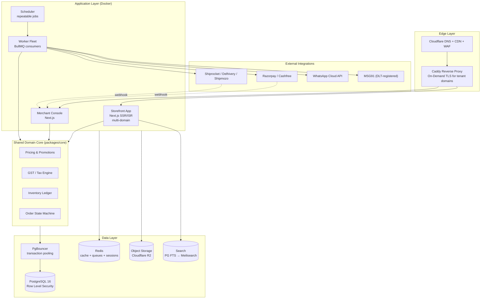
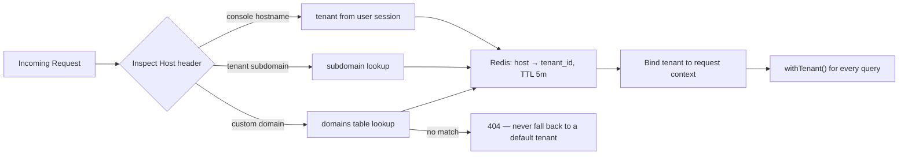
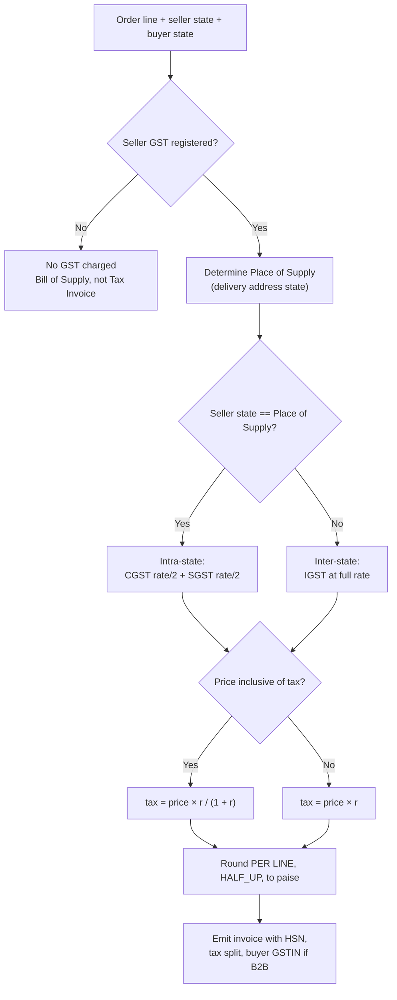
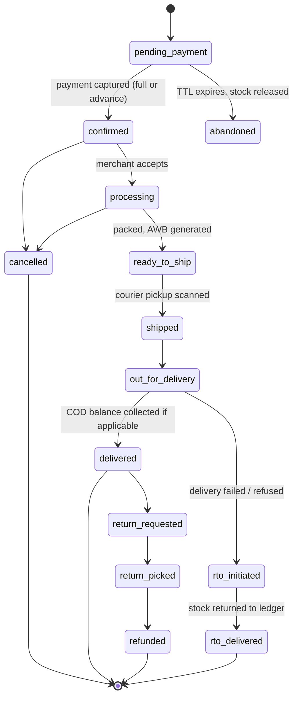
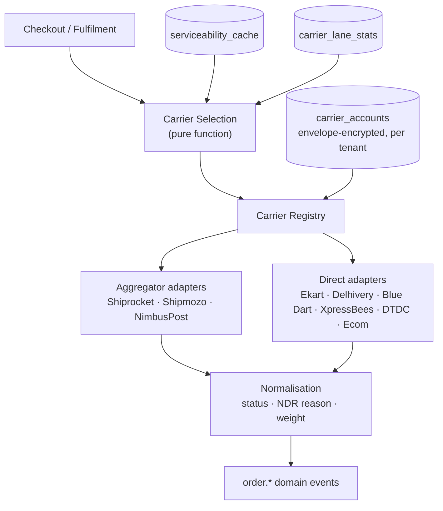
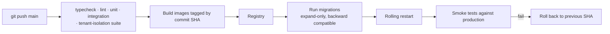

# Commerce Platform — Architecture Blueprint & Build Roadmap

A multi-tenant commerce platform: an engine that runs many independent online stores, each with its own catalog, customers, domain, branding, tax identity and payment account.

**Phase A — operate.** Run one store on it end to end, in production, with real orders and real money.
**Phase B — commercialise.** Open the same platform to other merchants as a subscription SaaS.

| Decision | Choice |
| :--- | :--- |
| Stack | Next.js (App Router) + TypeScript + PostgreSQL |
| Hosting | VPS + Docker (Hetzner / DigitalOcean) |
| Tenancy | Multi-tenant from day 1 |
| Market | India-first (GST, UPI, COD, WhatsApp, pan-India logistics) |

---

## 0. The One Idea That Governs Everything

You are not building a store. You are building a **store engine**.

Every design choice in this document follows from one rule:

> **No tenant may be hardcoded anywhere.**
> Not a GSTIN, not a courier account, not theme colours, not a free-shipping threshold, not a domain, not an invoice prefix, not a payment gateway key.

A store is a **row in the `tenants` table**. Honour that from the first migration and Phase B is a signup form plus billing. Break it even slightly and Phase B is a rewrite — because "extract the tenant" is the single most expensive refactor in SaaS, touching every query, every cache key, every migration, every background job and every file path simultaneously.

This holds even while only one store is live. The first tenant is not special; it is simply the first row. Operating the platform yourself before selling it is a genuine advantage — you feel every missing bulk-edit and confusing settings page while actually transacting — but that advantage only survives if the first store is built as *a* tenant rather than as *the* application.

---

## 1. System Architecture

### 1.1 High-Level Topology



### 1.2 Why a Modular Monolith, Not Microservices

At one store today and a few hundred merchants in year two, microservices buy nothing and cost distributed transactions, network partitions between "inventory" and "orders", and an ops burden a small team cannot carry.

Instead: **one deployable domain core, enforced module boundaries.**

- `packages/core` holds all business logic as pure TypeScript, split into modules (`catalog`, `inventory`, `pricing`, `orders`, `tax`, `logistics`).
- Modules talk through explicit exported interfaces, never by reaching into each other's tables.
- An ESLint boundary rule fails the build if `orders` imports from `catalog/internal`.

When a module genuinely needs to become a service in year three, the seam already exists. You get the option without paying for it now.

### 1.3 Application Split

| App | Domain | Rendering | Why separate |
| :--- | :--- | :--- | :--- |
| **Storefront** | tenant subdomains + custom domains | SSR + ISR, aggressively cached | SEO-critical, public traffic, must survive console deploys |
| **Console** | one platform hostname | Client-heavy, no caching | Auth-gated, different threat model, different scaling curve |
| **Worker** | none (headless) | — | Long jobs must never block a web request |

Three containers, one codebase, one `packages/core`. Deploy independently.

---

## 2. Multi-Tenancy — The Foundation

### 2.1 Isolation Model: Shared Database + Row Level Security

Every business table carries `tenant_id UUID NOT NULL`, and PostgreSQL itself enforces isolation. Application bugs cannot leak data across merchants, because the database refuses to return other tenants' rows regardless of what the query says.

```sql
ALTER TABLE products ENABLE ROW LEVEL SECURITY;
ALTER TABLE products FORCE  ROW LEVEL SECURITY;   -- applies to the table owner too

CREATE POLICY tenant_isolation ON products
  USING      (tenant_id = NULLIF(current_setting('app.tenant_id', true), '')::uuid)
  WITH CHECK (tenant_id = NULLIF(current_setting('app.tenant_id', true), '')::uuid);
```

Two details in that snippet are load-bearing, and both are commonly missed:

**`FORCE ROW LEVEL SECURITY` is not optional.** Without it, RLS is silently bypassed whenever the connecting role owns the table — the default in most setups, and the reason RLS "mysteriously does nothing" for so many teams.

**The `NULLIF` is what makes the policy fail closed.** `current_setting(name, true)` returns NULL only while the setting has never existed. The first `set_config` on a connection creates a placeholder, so later transactions that set no tenant read back an *empty string*, and `''::uuid` raises a type error. Without `NULLIF`, every context-free query errors instead of returning nothing — and under connection pooling that only begins once the pool warms up, making it a production-only failure.

Two database roles:
- `app_user` — owns nothing, no `BYPASSRLS`. Every web and worker request.
- `app_migrator` — runs migrations, `BYPASSRLS`. Used by exactly two things: the migration runner and audited support tooling.

### 2.2 Setting Tenant Context Safely

Every request opens a transaction and sets the tenant before touching data:

```ts
export async function withTenant<T>(
  tenantId: string,
  fn: (tx: Transaction) => Promise<T>,
): Promise<T> {
  if (!UUID_RE.test(tenantId)) throw new InvalidTenantIdError(tenantId);

  return db.transaction(async (tx) => {
    // SET LOCAL is transaction-scoped and therefore pooling-safe.
    // Never use a session-level SET.
    await tx.execute(sql`SELECT set_config('app.tenant_id', ${tenantId}, true)`);
    return fn(tx);
  });
}
```

Three rules make this bulletproof:

1. **Transaction-scoped only.** A session-level `SET` leaks tenant context to the next request that borrows the pooled connection — a catastrophic, intermittent, nearly unreproducible data leak.
2. **The raw database handle is not exported.** The package exposes `withTenant` and `withPlatform` and nothing else usable. An ESLint rule blocks importing the underlying client.
3. **Parameterised and validated.** Bound parameter, UUID-checked first, so a malformed or hostile id fails loudly rather than reaching a policy as an opaque cast error.

### 2.3 Control Plane vs Data Plane

Not every table can be RLS-protected, and pretending otherwise breaks login.

**Control plane** — queried *before* tenant context exists: `tenants`, `domains`, `users`, `tenant_members`, `sessions`, `otp_challenges`, `plans`. Hostname resolution and "which stores may this user enter?" are questions asked with no tenant selected, so a policy keyed on `app.tenant_id` could never be satisfied. These are filtered explicitly in code.

**Data plane** — everything else: catalog, inventory, orders, customers, settings, audit. RLS-protected, automatically.

The classification must be **default-deny**: a new table is tenant-scoped unless someone writes down why it is not. Deriving the rule from "does it have a `tenant_id` column" is wrong — several control-plane tables do have one — and CI enforces that every exception carries a written justification.

### 2.4 Tenant Resolution



"Never fall back to a default tenant" matters more than it looks. A misconfigured domain silently serving one merchant's catalog, prices and customers under another merchant's hostname is a trust-ending bug — and the kind that survives for months because nothing errors. Unknown host → hard 404. Unknown hosts also get a short **negative cache**, or bot traffic probing random hostnames becomes a database query per request.

### 2.5 Custom Domains at Scale — On-Demand TLS

This is the piece that quietly blocks most SaaS launches, so solve it on day one.

When a merchant points `shop.theirbrand.com` at you, you must obtain a TLS certificate for a domain you do not control, automatically, without a deploy. Caddy does this natively:

```caddyfile
{
  on_demand_tls {
    ask http://console:3001/api/internal/verify-domain
    interval 2m
    burst 5
  }
}
```

The `ask` endpoint answers `200` only if the hostname exists in the `domains` table **and** is marked verified. Without that check, anyone can point a DNS record at your IP and drive certificate issuance until Let's Encrypt rate-limits you — taking custom domains down for every tenant. This is an actively exploited failure mode, not a theoretical one.

Onboarding flow: merchant enters domain → shown a CNAME target → background job polls DNS → once resolved, mark verified → first HTTPS request triggers automatic issuance. Zero manual ops per customer.

### 2.6 Cache Keys and Background Jobs

Two places tenancy silently breaks, neither of which RLS can catch:

- **Cache keys must be tenant-prefixed.** `cache:${tenantId}:product:${slug}`, never `cache:product:${slug}`. Redis has no idea what a tenant is.
- **Every job payload carries `tenantId`,** and the handler's first act is `withTenant(job.data.tenantId, …)`. A job that infers tenancy any other way is a bug waiting for a busy festival evening.

---

## 3. Data Model

### 3.1 Conventions

Non-negotiable, applied everywhere:

| Concern | Rule | Rationale |
| :--- | :--- | :--- |
| Money | `BIGINT` paise. Never float | ₹0.1 + ₹0.2 ≠ ₹0.3 in binary floating point. Rounding disputes are real |
| Currency | Explicit `currency CHAR(3)` even though it is `INR` today | Multi-currency is a plausible year-three ask |
| Timestamps | `TIMESTAMPTZ`, UTC in storage, local only at render | Settlement cutoffs break on timezone-naive systems |
| IDs | UUIDv7 primary keys | Sortable like an int, non-enumerable in URLs, safe to generate offline for POS sync |
| Soft delete | `deleted_at` on catalog and customer tables | Merchants delete products by accident constantly |
| Audit | `created_at`, `updated_at`, `created_by`, `updated_by` on every mutable table | Staff accountability |

### 3.2 Core Schema (abridged)

```sql
-- ============ CONTROL PLANE (no RLS — see §2.3) ============
CREATE TABLE tenants (
  id                    UUID PRIMARY KEY,
  slug                  TEXT UNIQUE NOT NULL,
  legal_name            TEXT NOT NULL,
  display_name          TEXT NOT NULL,
  status                TEXT NOT NULL,          -- trial|active|suspended|churned
  plan_id               UUID REFERENCES plans(id),
  tax_registration_type TEXT NOT NULL,          -- unregistered|regular|composition
  gstin                 TEXT,
  origin_state_code     TEXT,                   -- drives CGST/SGST vs IGST
  created_at            TIMESTAMPTZ NOT NULL DEFAULT now()
);

CREATE TABLE domains (
  id            UUID PRIMARY KEY,
  tenant_id     UUID NOT NULL REFERENCES tenants(id),
  hostname      TEXT UNIQUE NOT NULL,
  is_primary    BOOLEAN NOT NULL DEFAULT false,
  verified_at   TIMESTAMPTZ,                    -- gates on-demand TLS
  redirect_to   TEXT                            -- apex → www canonicalisation
);

-- Identity is global so one person can staff several stores.
-- Membership, not identity, is the tenant-scoped concept.
CREATE TABLE users (
  id            UUID PRIMARY KEY,
  phone_e164    TEXT UNIQUE NOT NULL,
  email         TEXT,
  name          TEXT
);

CREATE TABLE tenant_members (
  tenant_id     UUID NOT NULL REFERENCES tenants(id),
  user_id       UUID NOT NULL REFERENCES users(id),
  role          TEXT NOT NULL,
  permission_overrides JSONB NOT NULL DEFAULT '{}',
  PRIMARY KEY (tenant_id, user_id)
);

-- ============ DATA PLANE (RLS-protected) ============
CREATE TABLE products (
  id            UUID PRIMARY KEY,
  tenant_id     UUID NOT NULL,
  title         TEXT NOT NULL,
  status        TEXT NOT NULL,
  hsn_code      TEXT,                           -- GST classification
  tax_rate_bps  INT,                            -- 1800 = 18%
  seo           JSONB NOT NULL DEFAULT '{}',
  deleted_at    TIMESTAMPTZ
);

CREATE TABLE product_variants (
  id                UUID PRIMARY KEY,
  tenant_id         UUID NOT NULL,
  product_id        UUID NOT NULL REFERENCES products(id),
  sku               TEXT NOT NULL,
  barcode           TEXT,                       -- POS scanning
  options           JSONB NOT NULL DEFAULT '{}',
  price_paise       BIGINT NOT NULL,
  compare_at_paise  BIGINT,
  weight_grams      INT NOT NULL,               -- courier rating
  dims_mm           JSONB,                      -- volumetric weight
  low_stock_at      INT DEFAULT 2,
  UNIQUE (tenant_id, sku)
);

-- Slugs are versioned so SEO redirects survive renames
CREATE TABLE url_slugs (
  tenant_id     UUID NOT NULL,
  slug          TEXT NOT NULL,
  entity_type   TEXT NOT NULL,
  entity_id     UUID NOT NULL,
  is_canonical  BOOLEAN NOT NULL DEFAULT true,  -- false ⇒ 301 to canonical
  PRIMARY KEY (tenant_id, slug)
);

-- Append-only stock ledger, not a mutable counter
CREATE TABLE stock_movements (
  id              UUID PRIMARY KEY,
  tenant_id       UUID NOT NULL,
  variant_id      UUID NOT NULL,
  location_id     UUID NOT NULL,
  delta           INT NOT NULL,        -- +50 restock, -1 sale, +1 RTO
  reason          TEXT NOT NULL,
  reference_type  TEXT,
  reference_id    UUID,
  idempotency_key TEXT,
  UNIQUE (tenant_id, idempotency_key)
);

CREATE TABLE orders (
  id                 UUID PRIMARY KEY,
  tenant_id          UUID NOT NULL,
  order_number       TEXT NOT NULL,
  channel            TEXT NOT NULL,       -- web|pos|whatsapp|manual
  status             TEXT NOT NULL,
  payment_status     TEXT NOT NULL,
  fulfilment_status  TEXT NOT NULL,
  subtotal_paise     BIGINT NOT NULL,
  discount_paise     BIGINT NOT NULL DEFAULT 0,
  shipping_paise     BIGINT NOT NULL DEFAULT 0,
  tax_paise          BIGINT NOT NULL DEFAULT 0,
  total_paise        BIGINT NOT NULL,
  amount_paid_paise  BIGINT NOT NULL DEFAULT 0,   -- partial payment
  cod_due_paise      BIGINT NOT NULL DEFAULT 0,   -- balance on the AWB
  place_of_supply    TEXT,
  buyer_gstin        TEXT,
  UNIQUE (tenant_id, order_number)
);

-- Line items SNAPSHOT price/tax/title at purchase time
CREATE TABLE order_lines (
  id                UUID PRIMARY KEY,
  tenant_id         UUID NOT NULL,
  order_id          UUID NOT NULL REFERENCES orders(id),
  variant_id        UUID,
  title_snapshot    TEXT NOT NULL,
  sku_snapshot      TEXT NOT NULL,
  hsn_snapshot      TEXT,
  quantity          INT NOT NULL,
  unit_price_paise  BIGINT NOT NULL,
  tax_rate_bps      INT NOT NULL,
  tax_paise         BIGINT NOT NULL
);
```

**The snapshot rule is load-bearing.** An order placed in March must reprint in October with March's price, March's tax rate and March's product title, even if all three changed. Every platform that joins invoices to live catalog rows discovers this during its first tax audit.

### 3.3 Invoice Numbering — A Correctness Trap

Indian GST requires invoice numbers that are **sequential, gap-free, unique per financial year, per series, per legal entity**. Under concurrent checkout, `MAX(number) + 1` produces duplicates, and an application-level counter produces gaps when a transaction rolls back.

```sql
CREATE TABLE invoice_series (
  tenant_id      UUID NOT NULL,
  series_code    TEXT NOT NULL,
  financial_year TEXT NOT NULL,
  prefix         TEXT NOT NULL,
  next_number    INT  NOT NULL DEFAULT 1,
  PRIMARY KEY (tenant_id, series_code, financial_year)
);
```

Allocate inside the order transaction with a row lock:

```sql
UPDATE invoice_series
   SET next_number = next_number + 1
 WHERE tenant_id = $1 AND series_code = $2 AND financial_year = $3
RETURNING next_number - 1;
```

`UPDATE … RETURNING` takes a row-level lock, serialising concurrent allocations. Because it runs in the order's transaction, a rollback returns the number rather than burning it. A PostgreSQL `SEQUENCE` is precisely the wrong tool here: sequences are non-transactional and deliberately leave gaps.

**Allocate at payment confirmation, not cart creation.** Abandoned carts must never consume numbers.

---

## 4. Domain Logic — The Hard Parts

### 4.1 GST Engine

This is where a generic commerce framework fails an Indian merchant, and therefore where the product earns its price.



Requirements that follow:

- **Per-line rounding, not per-invoice.** Round each line, then sum. Summing then rounding produces one-paise mismatches against the buyer's own accounting — a recurring source of B2B disputes.
- **Tax-inclusive extraction is the default in Indian retail.** Merchants list ₹999 and expect it to *be* ₹999 at checkout. Support both; default to inclusive.
- **Shipping is taxable**, at the rate of the principal supply in a composite supply. Model it as a line, not an afterthought.
- **Discounts reduce taxable value** when given at the time of supply and shown on the invoice. Apply coupons *before* tax computation.
- **Bill of Supply vs Tax Invoice.** Unregistered and composition-scheme merchants must not issue tax invoices. Phase B will onboard many such merchants — hence `tax_registration_type` on the tenant from day one.
- **GSTR-1 export** (B2B, B2C-Large, B2C-Small, HSN summary) as CSV matching the current utility layout.
- **E-invoicing (IRP/IRN)** applies above the prevailing turnover threshold. Design the invoice module so an IRN and signed QR can be attached later without a schema change. **Verify current thresholds and rules with a CA before go-live — this is an engineering plan, not tax advice.**

### 4.2 Order State Machine

Model states explicitly and reject illegal transitions in code. Free-form status strings mutated by whichever screen is open are the most common source of "the order shows delivered but was never shipped".



Each transition emits a domain event (`order.shipped`, `order.rto_initiated`) onto the queue. Messaging, analytics and inventory subscribe to events rather than being called inline from the checkout handler — which is how you avoid a WhatsApp API timeout failing a customer's payment.

**RTO deserves first-class treatment.** Indian COD return-to-origin rates routinely run 15–30%. RTO must restock inventory, reverse the invoice via a credit note, and feed a per-customer risk score that can gate COD eligibility for repeat offenders. Incumbent platforms handle this weakly; it is a genuine differentiation opportunity.

### 4.3 Partial Payment (Advance + COD)

```
advance_paise = clamp(round(order_total × advance_pct) OR fixed_advance_paise,
                      min = tenant.min_advance_paise, max = order_total)
cod_due_paise = order_total − advance_paise
```

The subtlety: `cod_due_paise` is pushed to the courier as the COD collection amount on the AWB, and the two systems must be reconciled. If a discount is applied later or the customer partially cancels, the AWB amount must be amended *before* pickup or the courier collects the wrong sum. Model it as derived-and-synced state with an explicit `awb_cod_synced_at`, and block edits after pickup.

### 4.4 Promotions Engine

Do not hardcode coupon types. Model rules as data so merchants can build promotions you never anticipated:

```ts
type Condition =
  | { type: 'cart_subtotal_min'; paise: number }
  | { type: 'contains_product'; productIds: string[] }
  | { type: 'contains_category'; categoryIds: string[] }
  | { type: 'customer_segment'; segmentId: string }
  | { type: 'first_order' }
  | { type: 'channel'; channels: Channel[] };

type Effect =
  | { type: 'flat_off'; paise: number }
  | { type: 'percent_off'; bps: number; maxDiscountPaise?: number }
  | { type: 'free_shipping' }
  | { type: 'buy_x_get_y'; buyQty: number; getQty: number; getVariantIds: string[] };
```

Evaluation is a pure function — `(cart, promotions, customer) → AppliedDiscount[]` — exhaustively unit-testable without a database. Discount bugs cost real money; this is the module to hold to 100% branch coverage.

Enforce usage limits with a `coupon_redemptions` table and a unique constraint, not an application-side counter. Counters race, and a coupon meant for 100 redemptions gets used 340 times during a flash sale.

### 4.5 Inventory Ledger

Never store a mutable `stock_count` as the source of truth. With web, POS, returns and manual adjustments writing concurrently, a counter drifts and cannot be audited.

```
available(variant) = SUM(stock_movements.delta)
                   − SUM(active stock_reservations.quantity)
```

Keep a materialised `stock_levels` projection for fast reads, always reconcilable against the ledger. When a merchant asks "why does this say 3 when I have 5?", you can answer with a timestamped list of every movement.

---

## 5. Integrations

Every integration lives behind an interface in `packages/core`, with vendor implementations in `packages/integrations`. This is a commercial requirement, not architectural purity: Phase B merchants arrive with existing courier and gateway accounts and will refuse to switch.

### 5.1 Multi-Carrier Logistics

The platform speaks to many logistics providers at once. Not as a future nicety — as a precondition for selling it, because a merchant already contracted with a carrier at negotiated rates will not abandon that to use a platform.

**Provider taxonomy.** The two kinds behave differently enough that the distinction is architectural:

| Kind | Providers | Behaviour |
| :--- | :--- | :--- |
| **Aggregator** | Shiprocket, Shipmozo, NimbusPost | Resell many carriers behind one API and run their own carrier assignment. The parcel's real carrier is known only after booking, hence `subCarrier` on quotes |
| **Direct** | Ekart, Delhivery, Blue Dart, XpressBees, DTDC, Ecom Express | Contracted directly with the merchant. Cheaper at volume, but each needs its own agreement, credential dance and status vocabulary |



**One adapter contract.** Adding a provider means one registry entry and zero changes to orders, checkout or console:

```ts
export interface CarrierAdapter {
  readonly code: CarrierCode;
  readonly capabilities: CarrierCapabilities;   // cod, reversePickup, qcOnReturn,
                                                // multiPiece, amendCodAmount,
                                                // volumetricDivisor, weightSlabGrams
  verifyCredentials(creds): Promise<{ ok: boolean; detail?: string }>;
  checkServiceability(creds, req): Promise<ServiceabilityQuote[]>;
  createShipment(creds, req): Promise<BookedShipment>;   // idempotency key required
  cancelShipment(creds, awb): Promise<void>;
  schedulePickup(creds, awbs, date): Promise<{ pickupId: string }>;
  track(creds, awb): Promise<TrackingEvent[]>;
  updateCodAmount?(creds, awb, amountPaise): Promise<void>;
  createReturn?(creds, req): Promise<BookedShipment>;
  parseWebhook(creds, raw, headers): Promise<TrackingEvent[]>;
}
```

Carriers **declare capabilities** rather than being special-cased. `if (carrier === 'delhivery')` scattered through fulfilment code is how a platform ends up unable to add a provider without a regression sweep.

**Status normalisation is the real work.** Every carrier invents its own vocabulary, resends events, and delivers them out of order. Translation happens once, at the adapter boundary, into a single 17-state taxonomy. Two failure modes get explicit defences:

- **Out-of-order events.** A retried `in_transit` landing after `delivered` must not reopen the order, re-fire customer notifications and corrupt the fulfilment funnel. Terminal states are final, and legitimate backward moves (NDR, on-hold, RTO) are enumerated rather than inferred from rank.
- **Ambiguous RTO text.** Bare "Returned to Origin" is read as *initiated*, not *delivered*. The errors are not symmetric: calling an RTO complete early restocks inventory still in transit and causes oversell, whereas lagging is corrected by the next event.

Unmapped statuses fall back to conservative keyword matching and are **reported, not swallowed** — carriers add codes without notice, and a silent fallback is how a delivered parcel ends up displayed as "on hold".

**Carrier selection is a pure, tested function.** The naive choice is the cheapest quote, which is usually wrong in India: the cheapest carrier on a lane often has the worst success rate, and one RTO erases the saving on twenty shipments. The `balanced` strategy scores expected total cost:

```
score = freight + (estimatedDays × dayValue) + (predictedFailureRate × rtoCost)
```

`predictedFailureRate` comes from `carrier_lane_stats` — what that carrier actually did on that lane for that merchant — with Laplace smoothing so three lucky deliveries do not hand a new carrier a monopoly. Strategies are `cheapest`, `fastest`, `balanced` and `preferred`, with constraints for COD support, SLA cap, freight cap, exclusions and a performance floor. Every rejected quote is returned with its reason, because "why did this parcel go by the expensive carrier?" is a question merchants ask constantly and most platforms cannot answer.

**Billable weight, not parcel weight.** Carriers bill `max(dead, volumetric)` rounded up to a slab, with the divisor and slab varying per carrier. Quoting on dead weight alone under-prices every bulky-light parcel — most of apparel and homeware. Carriers then re-weigh at their hub and bill the difference; unchallenged weight discrepancies are among the largest silent cost leaks in Indian e-commerce, so they are detected and surfaced for dispute rather than absorbed.

**Credentials are envelope-encrypted per tenant.** A fresh 256-bit data key per record encrypts the credential, and the master key wrapping it lives outside the database. AAD binds each blob to `(tenant, carrier)`, so a row copied between tenants fails to decrypt rather than handing one merchant another's carrier account. The console shows only a fingerprint; credentials are never logged and never returned to the browser.

**Serviceability is cached.** Uncached, every checkout makes N carrier API calls on the critical path of a page a customer is waiting on — slow, rate-limited, and a hard dependency on carrier uptime for checkout to render at all.

**Unwired adapters throw.** A stub that returns a plausible AWB would mark an order shipped with no parcel behind it. Adapters not yet integrated fail loudly and non-retryably, naming exactly what they need.

### 5.2 Payments — and the Regulatory Fork

**This is the most consequential non-technical decision in the project, and it is easy to get wrong late and expensively.**

The moment you take other merchants' customers' money into your own bank account and settle it onward, you are operating as a **Payment Aggregator**, which under RBI's guidelines requires authorisation, prescribed net worth, escrow arrangements and ongoing compliance. That is a licensed-financial-institution undertaking, not a feature.

| Model | How it works | Implication |
| :--- | :--- | :--- |
| **BYOG — Bring Your Own Gateway** (recommended) | Each merchant connects their own Razorpay/Cashfree account. Funds settle merchant-to-merchant; the platform never touches them. | No PA licence needed. The Shopify/WooCommerce model. Ship this. |
| **Aggregated settlement** | Money lands with the platform, which splits and remits. | Requires RBI PA authorisation, *or* riding a licensed partner's split-settlement rail as a sub-merchant platform. |

**Recommendation: build BYOG, and never build aggregation in-house.** If Phase B demand justifies split settlement later, do it on a licensed partner's rail (Razorpay Route, Cashfree Easy Split) under their compliance umbrella and with legal counsel.

The related trap: an entity that both facilitates supply *and* collects consideration on behalf of sellers is an **e-commerce operator** under Section 52 of the CGST Act, with TCS collection and GSTR-8 filing obligations. Pure SaaS (BYOG) sits outside that; aggregation walks straight into it. Two independent reasons to choose BYOG. **Confirm both with a CA and a lawyer before Phase B — treat this as a flag to investigate, not a legal opinion.**

Implementation notes:
- Per-tenant gateway credentials, **envelope-encrypted at rest** (§7.3). A leaked credentials table is an extinction-level event for a payments-adjacent SaaS.
- **Webhooks are the source of truth, never the browser redirect.** Customers close tabs; networks drop. Verify HMAC signatures, store raw payloads, process idempotently on the gateway event id.
- UPI carries zero MDR for person-to-merchant; cards roughly 1.8–2.5%. Surface true settlement economics in the console — merchants care intensely and incumbents obscure it.

### 5.3 Messaging — WhatsApp and SMS

WhatsApp is the primary channel for Indian commerce: abandoned cart, restock alerts, review requests, order tracking.

- **WhatsApp Cloud API** directly or via a BSP. Templates require pre-approval; marketing conversations are billed and subject to quality ratings that can throttle a poorly-behaved sender.
- **SMS requires TRAI DLT registration** — sender IDs and templates registered on a DLT portal, or carriers drop the messages. This surprises teams two days before launch. Register early.
- Model `message_templates` per tenant with an `approval_status`, behind a provider-agnostic `NotificationChannel` interface so email/SMS/WhatsApp/push are interchangeable per event type.
- **Consent and quiet hours are not optional.** Store opt-in provenance per customer per channel; under the DPDP Act you need a lawful basis and an auditable withdrawal path.

### 5.4 Integration Resilience

Every outbound call runs from a worker, never a web request, with:

- Exponential backoff with jitter, capped retries, and a dead-letter queue a human can inspect.
- A circuit breaker per vendor — when a courier API is down, fail fast and queue rather than exhausting the connection pool.
- Persisted, redacted request/response logs per tenant, ~30 days. When a merchant insists "the courier never got my order", you need the evidence.

---

## 6. Storefront, SEO and Performance

SEO is an architectural property, not a settings page — and the hardest thing on this list to retrofit.

### 6.1 Rendering Strategy

| Page | Strategy | Cache |
| :--- | :--- | :--- |
| Home, category, collection | ISR, revalidate on catalog change via tag | CDN + Next cache, tenant-tagged |
| Product detail | ISR with `revalidateTag('${tenantId}:product:${id}')` | CDN, purged on price/stock change |
| Cart, checkout | SSR, `no-store` | none |
| Account, order tracking | SSR, private | none |

Stock badges ("Only 2 left") must not force a fully dynamic product page — that sacrifices the CDN cache that makes the page rank. Render statically, hydrate live stock from a small client-side endpoint.

### 6.2 SEO Requirements

- **JSON-LD** `Product`, `Offer`, `AggregateRating`, `BreadcrumbList`, `Organization` — generated from data, never hand-authored per tenant.
- **Per-tenant `sitemap.xml`**, scheduled, split at 50k URLs behind a sitemap index, with `robots.txt` served per host.
- **Canonical URLs**, and 301s from every superseded slug (hence historical rows in `url_slugs`).
- **Core Web Vitals as a build gate.** LCP under 2.5s on a mid-range Android over 4G is the realistic Indian-market target. Budget images aggressively: AVIF/WebP pipeline, explicit dimensions to prevent CLS, no render-blocking third-party scripts.

### 6.3 Migrating a Store In

Any merchant arriving from another platform brings existing rankings, and a careless migration erases months of organic traffic. Build this as a **platform capability**, since every Phase B signup will need it:

1. **Crawl the source site** and export every indexed URL *before* switching anything.
2. **Build an explicit 301 map** from every old URL to its new equivalent. Preserving old slug patterns is cheaper than redirecting them.
3. **Export Search Console data** for top-performing pages; verify those manually post-launch.
4. **Stage on a `noindex` hostname**, verify JSON-LD in the Rich Results Test, then flip DNS.
5. **Post-cutover:** submit the new sitemap, monitor coverage and 404s daily for two weeks, keep the old store live but unlinked as a rollback path.

Never cut over during a sale period or the festive season.

---

## 7. Security

### 7.1 Authentication

Phone-first OTP matches Indian user expectations, but OTP is a weak primary factor and must be hardened:

- Rate limit per phone, per IP, per device. Fixed windows are trivially gamed; use sliding windows.
- 6-digit codes, 5-minute expiry, max 5 attempts, single use, constant-time comparison, stored only as an HMAC keyed by a server-side pepper.
- **Require TOTP or passkey second factor for `owner` and `manager`.** A console holds payment credentials, customer PII and refund authority — SIM swap is a realistic threat, and an OTP-only owner account is one social-engineering call from full compromise.
- Server-side sessions with absolute *and* idle timeouts, and working "sign out everywhere". Idle expiry alone lets a stolen token live indefinitely under light use.

### 7.2 Authorisation

Permission checks belong in `packages/core`, not in React components. Hiding a menu item is presentation; the API must independently reject the call. Every mutation resolves `(user, tenant) → role → permission set` server-side, and every denial is logged.

Check **permissions, never roles**. `if (role === 'owner')` scattered through the codebase is how you end up unable to offer custom roles in Phase B without touching every call site. Store permissions as data so merchants can define roles without a deploy.

### 7.3 Secrets and PII

- **Envelope encryption for tenant payment credentials and API keys:** per-tenant data key wrapped by a master key held outside the database.
- **PII minimisation.** Customer phone and address are needed; card data is neither needed nor permitted — that stays with the PCI-compliant gateway.
- **DPDP Act 2023:** purpose limitation, breach notification, and data-principal rights (access, correction, erasure). Build per-customer export and deletion jobs in Phase 4 rather than scrambling at the first request.
- **Support impersonation must be explicit, consented, time-boxed and loudly audited.** When platform staff can log into any merchant's console, that power needs a paper trail — for their trust and your legal protection. The audit table should carry no `UPDATE`/`DELETE` grant: append-only enforced by privilege, not convention.

### 7.4 The Multi-Tenant Test Suite

Write these before they are needed; run them in CI on every commit:

1. For every tenant-scoped table, a query under tenant A returns zero of tenant B's rows.
2. A forged `tenant_id` in a request body cannot override the resolved tenant, and cross-tenant `INSERT`/`UPDATE`/`DELETE` are all refused.
3. Tenant context does not survive its transaction — the pooled-connection leak.
4. A schema-diff test fails the build if any new table is neither RLS-protected nor carrying a written justification.
5. The application role holds no `BYPASSRLS` and is not a superuser.

Test 4 is the highest-leverage test in the codebase: it converts the discipline of §0 from a rule people remember into a rule the build enforces.

---

## 8. Infrastructure

### 8.1 Topology

Start with two machines. Resist the urge to build a cluster.

| Host | Spec (starting point) | Runs |
| :--- | :--- | :--- |
| `app-1` | 8 vCPU / 16 GB / NVMe | Caddy, storefront ×2, console, worker ×2, Redis |
| `db-1` | 4 vCPU / 16 GB / NVMe | PostgreSQL 16, PgBouncer, pgBackRest |

Cloudflare in front for DNS, CDN, WAF and DDoS absorption. Object storage on R2 (zero egress, which matters when serving product images).

A single VPS pair at roughly €50–80/month comfortably serves the first store plus the first tranche of SaaS tenants. That is the economic argument for the VPS choice: **predictable cost per tenant**, which is what makes a ₹999–2999/month subscription actually profitable in a market where per-request cloud pricing quietly eats the margin.

### 8.2 Deployment



**Expand/contract migrations, always.** Add a column, deploy code writing both old and new, backfill, deploy code reading new, drop the old column in a later release. Never a destructive migration in the same deploy as the code depending on it — that is what makes rollback possible, and you will need rollback.

### 8.3 Backups and Recovery

- Continuous WAL archiving to object storage plus nightly fulls, 30-day retention.
- Targets: RPO ≤ 5 minutes, RTO ≤ 1 hour.
- **A restore you have not tested is not a backup.** Automate a monthly restore into a scratch container with row-count assertions, and alert on failure.
- Per-tenant logical export doubles as a product feature (data portability) and a support tool (undo a merchant's catastrophic bulk edit).

### 8.4 Observability

- **Structured JSON logs** with `tenant_id`, `request_id`, `user_id` on every line.
- **OpenTelemetry traces** across web → worker → external calls.
- **Business alerts matter more than infrastructure alerts.** "Zero orders in the last 60 minutes during business hours" catches broken checkouts that a green CPU dashboard happily hides. Also alert on payment webhook failure rate, courier error rate, queue depth, invoice-numbering anomalies.
- **Per-tenant usage metering from day one** — orders, storage, messages, API calls. Phase B pricing depends on this data existing historically, and you cannot backfill it.

---

## 9. Repository Layout

```
commerce-platform/
├─ apps/
│  ├─ storefront/           Next.js — public, multi-domain, SEO-critical
│  ├─ console/              Next.js — merchant admin + API route handlers
│  └─ worker/               BullMQ consumers + scheduler
├─ packages/
│  ├─ core/
│  │  ├─ catalog/  inventory/  pricing/  tax/
│  │  ├─ orders/   logistics/  payments/ messaging/
│  │  ├─ identity/          auth, sessions, permissions
│  │  └─ tenancy/           hostname → tenant resolution
│  ├─ db/                   schema, migrations, RLS, withTenant
│  ├─ integrations/         gateway/ courier/ whatsapp/ sms/ adapters
│  ├─ ui/                   shared design system
│  └─ config/               eslint, tsconfig, tailwind presets
├─ infra/
│  ├─ docker/               Dockerfiles, compose, postgres init, pgbouncer
│  ├─ caddy/                Caddyfile with on-demand TLS
│  └─ scripts/              backup, restore-test
└─ docs/
```

**Tooling:** pnpm workspaces + Turborepo · Drizzle ORM (chosen over Prisma for the direct SQL control that RLS and the tax/ledger queries need) · Zod at every boundary · Vitest + Playwright · BullMQ on Redis.

---

## 10. Roadmap

Estimates assume one to two experienced full-stack engineers. Phases overlap where dependencies allow.

### Phase 0 — Foundations · Weeks 1–3 ✅ **complete**
- Monorepo, Docker dev environment, CI pipeline
- Postgres + PgBouncer + RLS + `withTenant` + the §7.4 isolation suite
- Tenant/domain resolution, on-demand TLS gating
- Phone OTP auth, server-side sessions, role permissions, audit log
- **Exit criterion:** two tenants on two hostnames, provably unable to see each other's data

### Phase 1 — Catalog & Storefront · Weeks 3–7
- Products, variants, options, categories, collections; bulk CSV import/export
- Media pipeline: upload → resize → AVIF/WebP → object storage → CDN
- Storefront: home, category, PDP, search (Postgres FTS to start)
- SEO: JSON-LD, meta management, sitemap, canonicals, slug history/301s
- **Exit criterion:** a full catalog live on a staging domain, passing the Rich Results Test

### Phase 2 — Commerce Core · Weeks 6–11
- Cart, reservations, checkout, pincode serviceability
- Payment gateway integration incl. partial payment; webhook-first confirmation
- Order state machine, inventory ledger, domain events
- GST engine + tax invoice PDF + invoice numbering
- Promotions engine + redemption limits
- **Exit criterion:** a real ₹1 order completes end to end with a correct GST invoice

### Phase 3 — Fulfilment · Weeks 10–13
*The multi-carrier framework (§5.1) is already built and tested: adapter contract, registry, status normalisation, selection engine, billable weight, encrypted credentials. What remains is vendor wiring and the order-facing surface.*
- Wire the HTTP transport for the first two carriers — one aggregator, one direct — against their live API docs
- Serviceability and rate quoting at checkout, backed by the cache
- AWB generation, label/manifest, pickup scheduling
- Tracking webhooks → normalised events → order state machine → customer notifications
- NDR workflow: auto-reattempt vs customer action, driven by normalised reason codes
- COD reconciliation, RTO handling, returns, refunds, credit notes
- Weight-dispute queue in the console
- Populate `carrier_lane_stats` from outcomes so `balanced` selection has real data
- **Exit criterion:** an order ships, tracks and delivers with no manual courier-panel work

### Phase 4 — Growth & Retention · Weeks 12–16
- WhatsApp Cloud API + DLT-registered SMS + transactional email
- Abandoned cart recovery, restock alerts, review requests, lead capture
- Reviews with moderation and aggregate-rating schema
- Customer CRM, segments, consent, DPDP export/erasure jobs
- Analytics: revenue, funnel, cohorts, product performance

### Phase 5 — POS · Weeks 15–18
- Terminal UI (tablet-first), barcode scanning, cash/UPI/card tender
- Shift open/close, cash drawer reconciliation
- **Offline-first with local persistence and conflict-resolving sync** — Indian retail connectivity demands it, and this is the hardest engineering problem in the build. Budget accordingly.
- Unified online + offline inventory and analytics

### Phase 6 — Production Launch · Weeks 17–20
- Data import from the incoming platform: catalog, customers, historical orders
- The §6.3 redirect map, staged and verified
- Parallel run, DNS flip, two-week monitoring window
- **Exit criterion:** the first store runs entirely on this platform. Phase A met.

### Phase 7 — SaaS-ification · Month 6 onward
*Only after the first store has run in production for a full month, including a sale event. The operational scars from that month are the requirements document for this phase.*

- Self-serve signup, tenant provisioning, guided onboarding
- Plans, subscription billing, usage metering, feature flags per plan
- Theme system: multiple storefront themes, per-tenant branding, section editor
- Custom domain self-service; merchant-facing status page
- Support tooling: audited impersonation, tenant health dashboard
- Public REST API + outbound webhooks + API keys
- **Exit criterion:** a merchant you have never met signs up, connects a domain, and takes a real order without you touching anything

---

## 11. Product Differentiation

Feature parity with incumbents gets you nowhere commercially — they already have parity with themselves, plus scale and a sales team. These are the gaps worth attacking:

| Gap in incumbent platforms | Opportunity |
| :--- | :--- |
| **Opaque economics** | Show true per-order margin: COGS, gateway fee, shipping, RTO loss, ad spend. Merchants fly blind on profitability |
| **Weak RTO handling** | COD risk scoring, RTO prediction, address-quality checks at checkout. The single largest profit leak in Indian D2C |
| **Data lock-in** | Full export, public API, webhooks. Make portability a selling point — it disarms the biggest objection to switching |
| **Rigid promotions** | The data-driven rules engine of §4.4 versus a fixed list of coupon types |
| **No inventory auditability** | A movement ledger answers "why is this number wrong?" |
| **Generic storefronts** | Real theming with section editing, not a colour picker |
| **Templated SEO** | Per-page control, schema validation, Core Web Vitals as a build gate |

---

## 12. Risk Register

| Risk | Severity | Mitigation |
| :--- | :--- | :--- |
| Payment aggregation triggers RBI PA licensing / GST TCS obligations | **Critical** | BYOG model (§5.1). Legal + CA review before Phase B |
| Cross-tenant data leak | **Critical** | RLS with `FORCE` + `NULLIF`, transaction-scoped context, CI isolation suite (§7.4) |
| SEO collapse during a store migration | **High** | Redirect map, staged verification, two-week monitoring (§6.3) |
| GST miscalculation → compliance exposure | **High** | Pure-function tax engine, exhaustive tests, CA review of invoice formats |
| Owner account compromise via SIM swap | **High** | Mandatory TOTP/passkey for owner and manager |
| Building SaaS features before operating the product | **High** | Phase 7 gated on a full month of live operation |
| Offline POS sync conflicts | **Medium** | Design spike before Phase 5; UUIDv7 enables offline id generation |
| Single VPS failure | **Medium** | Tested PITR restore; add a standby replica once paying tenants exist |
| Courier/gateway vendor lock-in | **Medium** | Adapter interfaces from day one (§5.1); adding a carrier is one registry entry |
| Carrier status mis-mapping (RTO counted as delivered) | **Medium** | Conservative normalisation, unmapped statuses reported not swallowed, tested (§5.1) |
| Silent weight-discrepancy charges | **Medium** | Billable-weight model plus a dispute queue (§5.1) |
| Leaked tenant carrier/gateway credentials | **High** | Envelope encryption, AAD-bound to (tenant, carrier), master key outside the DB (§5.1, §7.3) |
| WhatsApp template rejection or quality throttling | **Low** | Register templates early; keep SMS and email fallbacks |

---

## 13. Immediate Next Steps

1. **Confirm the payments model with a CA and a lawyer** (§5.1). Everything about Phase B's commercial structure hangs on it, and it is cheapest to resolve before more code exists.
2. **Start TRAI DLT registration and WhatsApp Business verification now** — multi-week lead times that will otherwise block Phase 4.
3. **Build Phase 1 — Catalog & Storefront.** Phase 0 is complete and verified.

---

*This document is an engineering plan. The GST, RBI and DPDP observations flag areas requiring professional advice — they are not tax or legal advice, and specific thresholds and obligations should be verified with qualified advisors before launch.*
